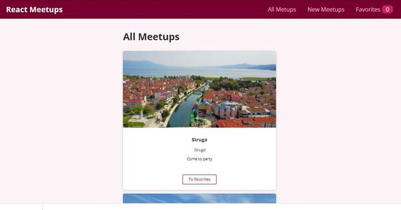

# Food order Application

This is project of Acedimind Udemy complete course on React.

## Built With

- ReactJS

## Installation

Go to your terminal, navigate to your working directory and run

`git clone https://github.com/Nuri1977/meetups-academind`

After that navigate to the newly created folder

`cd meetups-academind`

You now have access to the files.
To install necessary dependencies run

`npm install`

Start a local server running the command

`npm start`

You should now have the project running locally on a dev server.

## Author

👤 **Nuri Lacka**

- GitHub: [@Nuri1977](https://github.com/Nuri1977)
- Twitter: [@Lackanuri](https://twitter.com/LackaNuri)
- LinkedIn: [@nurilacka](https://www.linkedin.com/in/nuri-lacka-7141b01ba/)

## 🤝 Contributing

Contributions, issues, and feature requests are welcome!

Feel free to check the [issues page](../../issues/).

## Show your support

Give a ⭐️ if you like this project!

## Acknowledgments
- [Academind](https://academind.com/)
